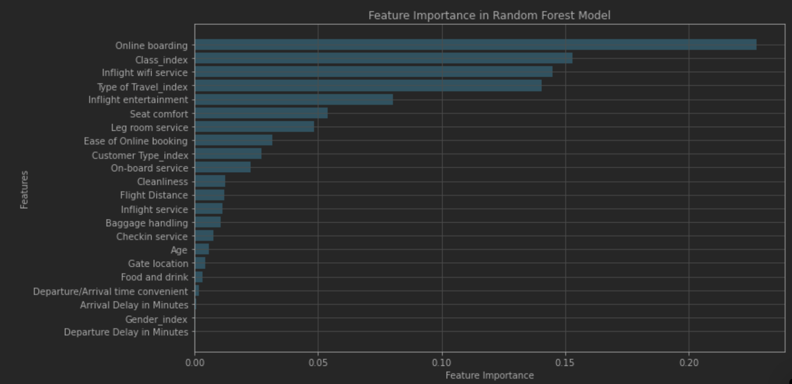
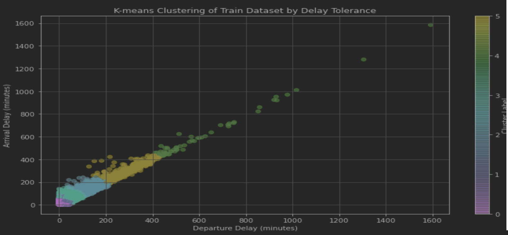

# ✈️ Airline Passenger Satisfaction Analysis

This project explores factors influencing airline passenger satisfaction using machine learning and Spark-based big data tools.

---

## 🔍 Project Overview

Analyzed airline passenger survey data through four key tasks:

- **Linear Regression**: Predicted arrival delays based on flight features, evaluated with RMSE.
- **Support Vector Machine (SVM)**: Classified satisfaction using Spark MLlib, evaluated with ROC AUC.
- **Random Forest**: Identified key features driving satisfaction, assessed with precision-recall metrics.
- **K-means Clustering**: Segmented passengers by satisfaction and delay tolerance, visualized with clustering tools.

---

## 🧰 Tools & Technologies

- **Languages**: Python  
- **Frameworks**: PySpark, Spark MLlib  
- **Libraries**: pandas, matplotlib, seaborn, scikit-learn  
- **Platform**: Jupyter Notebook  

---

## 📁 File

- `code.ipynb`: End-to-end pipeline including preprocessing, modeling, evaluation, and visualization

---

## 📊 Visualizations

### 🎯 Feature Importance (Random Forest)

Identified the most influential features for predicting satisfaction.

---

### 🎯 K-means Clustering Results

Visualized passenger segmentation by delay tolerance and satisfaction.

---

## 📈 Key Outcomes

- Built scalable models with Spark to analyze millions of records efficiently  
- Identified top drivers of satisfaction (e.g., inflight service, cleanliness)  
- Produced clear visualizations and insights to support airline decision-making  

---

> 📌 This project demonstrates real-world data science techniques including classification, regression, clustering, feature importance, and big data tools (Spark).
